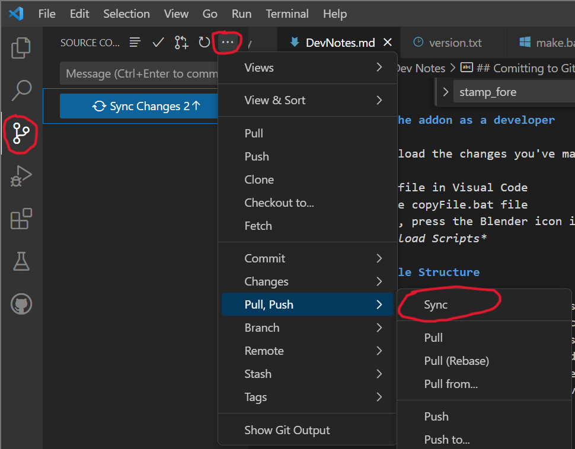
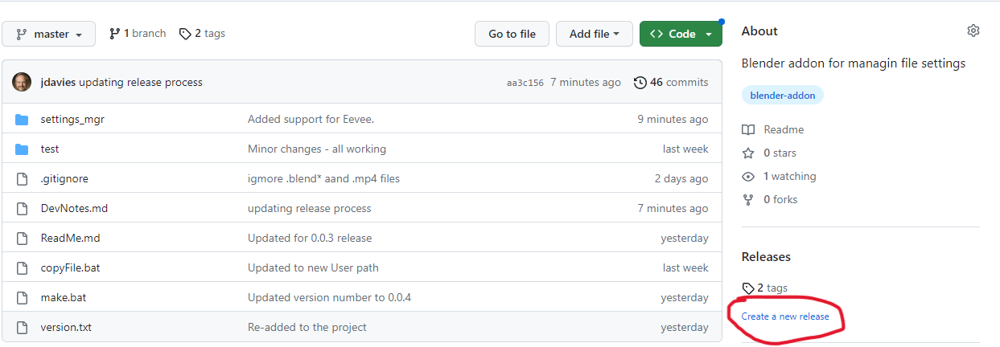
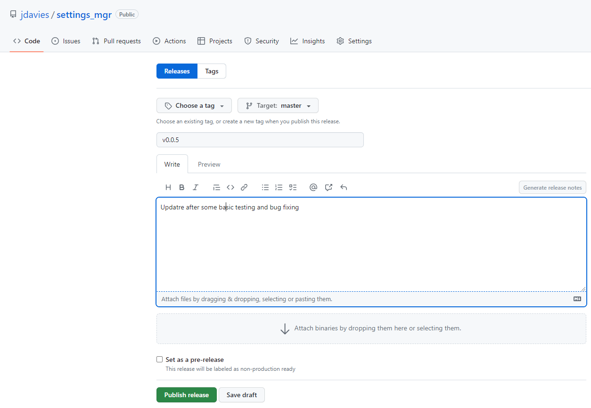

# Dev Notes

## Updating the addon as a developer

To quickly reload the changes you've made to the addon while testing:

1. Save your file in Visual Code
1. Execute the copyFile.bat file
1. In Blender, press the Blender icon in the upper-left corner and select *System -> Reload Scripts*

## Project File Structure

The root folder holds the utility files for building the addon.
**settings_mgr/** contains the source code.
**test/** Contains scratchpad code I use for testing things in pure python. It has nothng to do with the addon.
**copyFile.bat** simply copies the files into the Blender addon folder. See Updating the addon as a blender developer for it's use.

## Comitting to Github

Notes to myself since I always forget the details of this process!

## Releasing the addon

1. Update the version numbers in the **settings_mgr/\_\_init\_\_.py**, the **make.bat** and the **version.txt** files.
1. Update the release notes in **ReadMe.md**
1. Commit everything to the local Git repository on my machine.
1. Push all changes to the remote Git repo (Push  / Pull -> Sync)

1. Create a release: Add a tag for the release using the Giuthub web UI, not VS Code's Git extension.

1. Be sure to press the Enter key when you create the tag an not just click outside of the box.

